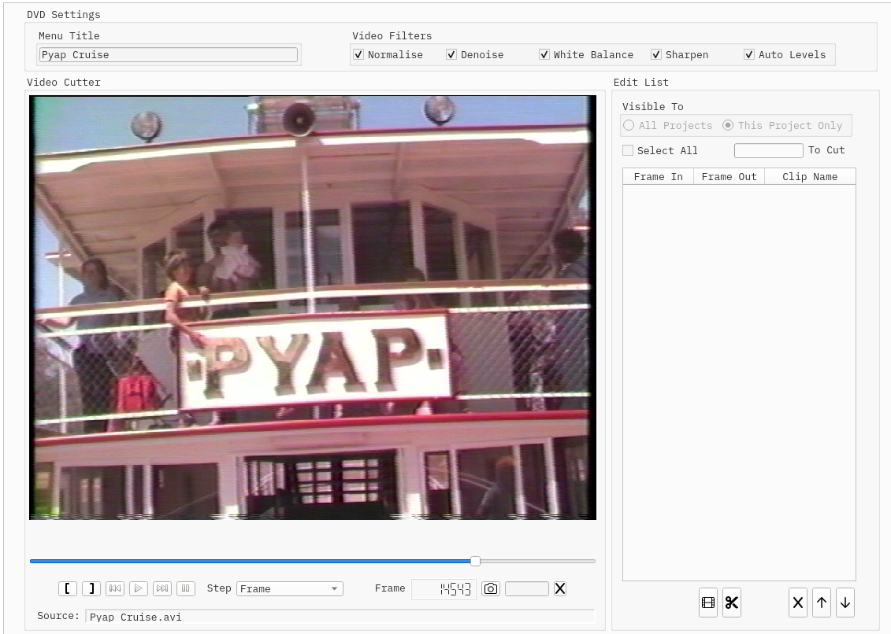
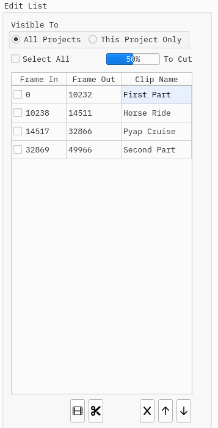
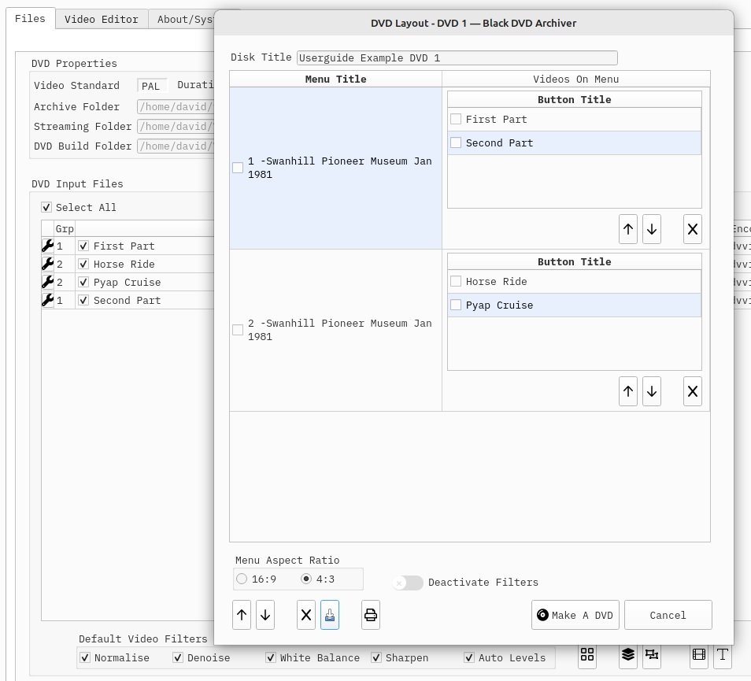

# The Black DVD Archiver - βeta 1.0 Release
The Black DVD Archiver is an application that will place user selected video files on a DVD and the source files in an 
archive location specified by the user. 

## Why Black? 
Henry Ford is reputed to have said "...You can have any colour you like as long as it is black..." likewise, you can have 
any DVD/Video settings you want in The Black DVD Archiver as long as they are the settings the author chose.
 
These settings are optimised at getting VHS, Beta and 8mm analogue video onto a DVD at the best possible quality that 
allows 2 hours to fit on a 4.7 GB disk.

The Black DVD Archiver is designed to do this task with the least amount of work by the user and to produce DVD's with 
a consistent menu layout suitable for a collection.

Can the author be persuaded to be more flexible and add additional features? Possibly...with a very good reason.

## Features
* Selection Of Input Files In A Variety Of Container Formats - As Long As They Conform To PAL/NTSC standards
* A Simple Video Editor
* Limited Video Filters With Fixed Settings
* DVD's Have A Simplified Menu Structure
* Saves The Input/Ouput Files In A User-Selected Archive Folder. 
  * This Can Be Placed On A NAS And Accessed By A Media Player.
  * An ISO image of the DVD is produced so that DVD burning software can produce the physical DVD. 
    * Brasero is a good choice, choose the "Burn Image" option (https://wiki.gnome.org/Apps/Brasero) 
  
  _Example Archive Folder Structure_
   

## Why Archive To DVD?
In short, because DVD's are offline, they last, and they are easy to share.

SD cards, USB and Solid State Drives are not long term storage solutions because data stored on them is held in tiny 
cells as an electric charge that slowly leaks away.  

Similarly, Hard Disk Drives are not reliable because they are 
electromechanical devices with components that degrade over time even sitting on a shelf.  In fact, do not bet on more 
than 10 years from either, and I have seen both go bad in a lot less than that.

Offline magnetic tape storage can be long-lasting, if stored correctly, but requires specialised cassettes and drives. 
These maye be hard to source for individuals in decades to come.

Storing data in the cloud is betting on a companies' longevity, security, backup policies and continued support. It also 
depends on people passing on their login details after they die.

As a final note, archiving important material should be an in depth approach that utilises some of the above methods to 
avoid long term data loss, taking into account the deficiencies of each method. Offline optical disks (DVD/Blu-ray) are
the last best line of defence and the longest lasting and most accessible for individuals, particularly if neglected.

**Archiving for individuals** means a descendant can be digging through a hot dusty attic in say 50 years or a century 
and finding media that has retained data. 

Because DVD's are ubiquitous and held in official archives, it is highly likely a means can be found to play them or 
transfer their contents to future media for playback and sharing.

Successful consumer media playback and recording formats have very long lives, and because people collect them there is 
an incentive to find a way to play them back. Records, Cassettes, VHS, CD,  DVD and Blu-ray are all testaments to this.

Case in point VHS tapes, I have some now  over 40 years old and I can still play them. 

**Quality** DVD-R's/Blu-ray's burned correctly are the only media that an individual can rely on for long-term archiving 
today. I have some DVD-R's on a shelf behind me that are over 20 years old and test just fine.  I have CD-R that are 
over 25 years old and they test fine.  

## Points To Note
* PAL Specs - 720 W * 576 H, Aspect Ratio 4:3, 25 frames a second interlaced (50 fields a second)
* NTSC Specs - 720 W * 480 H, Aspect Ratio 4:3, ~30 (29.97) frames a second interlaced (60 fields a second)
* 16:9 Aspect ratio, usually from camcorders, uses the same resolution just remaps pixels from square to rectangular
* Interlaced videos are kept as interlaced. Resizing and deinterlacing are best left to the display device
* Only 4 GB Single Layer DVDs are supported as they are assumed to have the best archival qualities
* Supported Container Formats 
  * mp4, avi, mkv, vob,mod,mov,webm,m4v,3gp, 
    3g2, mj2,mkv,mpg,mpeg,ts, m2ts, mts,qt,
    wmv, asf,flv,f4v,ogg,ogv,rm, rmvb,divx,mxf,
     dv,mts

# User Manual
## System Requirements
The Black DVD Archiver is a Linux program licensed under the terms of the GNU General Public License v3.0.
* A Linux operating system - Debian based
* Developed and tested on Linux Mint
* 16+ GB RAM
* 50+ GB of free disk space

## Installation
* Download the "black-dvd-archiver" (insert link) to your Programs folder.
* Double-click on the "black-dvd-archiver". It will take a few seconds to start.

## The Main Window

When the "black-dvd-archiver" has started, the user will see the main window above.

### The DVD Properties Panel

The DVD Properties panel displays:
 * _Video Standard_ - PAL/NTSC. This is set by the videos displayed in the "DVD Input Files" 
panel
   * A DVD is permitted to only be PAL or NTSC
 * _Duration_ - This is set by the videos selected in the "DVD Input Files" panel.
   * Maximum 2 hours
 * _Avg Bitrate_ - The bit rate used to encode the DVD. 
   * Fixed and set to 5.5 Mb/s. This allows 2 hours of video on a DVD in high quality
 * _DVD_Used_ - The percent of the DVD used by the selected files.
   * Only 99% is available this allows 1% to cover for any time overruns.
     * The added benefit of providing a small buffer on the outer edge of the DVD is to protect the DVD from edge damage 
 * _Archive Folder_ - This is set by the user
   * The Archive Folder is where the DVD image, ISO image (used to burn a DVD) and 
   DVD source files are stored.
   * The Archive Folder is best placed on a NAS (Network Attached Storage) device 
   where a media-player can access it.
   * The DVD file folder is composed of a unique code and the project name: e.g DVD-HV-000209-6_Userguide_Example
     * DVD - Is self-explanatory
     * HV - Home Video
     * 000209 - Sequential Folder Number
     * 6 - Check sum
     * Userguide_Example - The Project Name 
 * _DVD Build Folder_ - This is set by the user
   * The folder in which all the assets required to build a DVD are marshalled
   * It will be overwritten on the next DVD build
   * The relevant files will be copied from here to the _Archive Folder_ when a DVD build is complete
 
### DVD Input Files Panel

Displays the list of video files selected to comprise a DVD project
* _Select All_ - Checking this selects all video files in the grid. Unchecking deselects all files in te grid
*  - Enables and selects the [Video Editor Tab](#video-editor-tab)
* _Grp_ - Displays the group a video file belongs to (optional)
* _Video File_ - Displays the video file name or video title 
* _Width_ - Displays the video file width
* _Height_ - Displays the video file height
* _Encoder_ - Displays the video encoder used to encode the video file
* _System_ - Displays the video file TV system (PAL/NTSC)
* _Duration_ - Displays the video file duration in hourse, minutes, seconds

At the bottom of the video file grid is the _Default Video Filters_ and control buttons.

#### Video File Filters
* _Default Video Filters_ - These are the video filters applied by default to the project files.
In general, it is best not to filter unless absolutely  required as it takes time and can impact image 
quality. The settings chosen for these filters are aimed at having the minimal impact on video  quality

  * _Normalise_ - Attempts to bring out the shadow details
  * _Denaise_ - Applies a light noise filter to the video files (Can be slow)
  * _White Balance_ - Attempts to correct the white balance of the video files
  * _Sharpen_ - Applies a light sharpen to the luminance channel only
  * _Auto Levels_ - Attempts to brighten a video. If you need this then the video is likely to be of poor quality and 
  good results can not be expected.

#### Command Buttons
The operation of these buttons is as follows:
  *  - Opens [The Choose Video  Files Window](#the-choose-video-files-window)
  *  - Deletes the checked (selected) video files from the file grid
  *  - Moves the checked (selected) video files down in the grid
  *  - Moves the checked (selected) video files up in the grid
  *  - Toggles the _Video File_ name displayed in the grid between the video 
  file name and the DVD menu name
  *  - Joins the checked (selected) video files.
    * The first of the selected files becomes the joined video file and the other video files are removed from the grid.
  *  - Removes the grouping from the checked (selected) video files
  *  - Groups the checked (selected) video files together
    * Grouped files stay on the same DVD page
  *  - Opens the [DVD Menu Configuration Window](#dvd-menu-configuration-window) 

At the bottom of the _Main Window_ are the following buttons:
*  - Exits the "Black DVD Archiver"
    * Saves the current view which is then loaded when the "Black DVD Archiver" is started again
*  - Manages project DVD layouts. 
  * The DVD layout combo box allows users to select the desired DVD layout by clicking on it.
  * If a project has more than 2 hours of video then more than one DVD layout will be needed
  * DVD layouts also allow for different DVD's to be produced from the project video files
    *  - Deletes a DVD Layout
    *  - Opens the _Enter DVD Layout_ window to create a new DVD layout
      * 
      
*  - Manages projects. 
  * A project is comprised of video files displayed in the file grid and the dvd layouts associated with it
  * The project cmbo allows the user to select the desired project by clicking on it,
  * Projects are saved when changed or the user exits the "Black DVD Archiver" or changes projects
    *  - Deletes a Project and all associated DVD layouts
    *  - Opens the _Enter Project Name_ window to create a new project
      *  
      
*  - Opens the [DVD Layout Window](#dvd-layout-window) which allows the user to create a DVD

## The Choose Video  Files Window

This window allows the user to choose the video files for the DVD project. 
* Click on the video files required and click on the _Ok_ button when done.
* _Select All_ - Checking this selects all video files in the grid. Unchecking deselects all files in te grid

 - Use this button to select the video file source folder
* Opens the window below which allows the user to navigate the folder tree to the desired folder.
  * 

## DVD Menu Configuration Window

This window allows the DVD menu properties of the "Black DVD Archiver" to be set.

DVD menu pages consist of a grid of image buttons with text placed on the bottom of each button image.

When video files are grouped or there are fewer button titles on the menu page than the grid allows for, then the
buttons are laid out in the most pleasing possible manner by an internal algorithm 

### Menu Properties Panel

* _Buttons Per Page_ - Set the maximum number of DVD menu buttons on a menu page.
  * Minimum is 1 and Maximum is 6
* _Buttons Across_ - Set the maximum number of DVD buttons across the menu page
  * Minimum is 1 and Maximum is 4
### Menu Font Panel
* _Text Color_ - This combo box sets the color of the title text at the top of each DVD menu page
  * This is the same for all DVD menu pages
* _Background Color_ - This combo box sets the background color of the DVD menu page
  * This is the same for all DVD menu pages
* _Font_ - This combo box sets the font of the title text at the top of each DVD menu page
  * This is the same for all DVD menu pages
* _Font Size_ - This combo box sets the font size of the title text at the top of each DVD menu page
  * This is the same for all DVD menu pages
### Button Font Panel
* _Text Color_ - This combo box sets the color of the title text on the image button 
  * This is the same for all DVD image buttons
* _Background Color_ - This combo box sets the background color of the title text on the image button
  * This is the same for all DVD image buttons
* _Font_ - This combo box sets the font of the title text on the image button
  * This is the same for all DVD image buttons
* _Font Size_ - This combo box sets the font size of the title text on the image buttons
  * This is the same for all DVD image buttons
* _Transparency_ - This combo box sets the transparency of the title text and text background on the image buttons
  * This is the same for all DVD image buttons
  * Given that the text and background color are overlaid on the bottom part of the image button making this a little 
  transparent might be more visually pleasing

## Video Editor Tab

This tab enables basic video editing functionality. It is accessed via the  
button on the [DVD Input Files Panel](#dvd-input-files-panel)  

### DVD Settings Panel

* _Menu Title_ - A menu title is entered here by the user.
  * By default, a menu title is automatically extracted from the file name. The user can override this.
* _Video Filters_ - The video filters to be applied to the file. [Video File filters](#video-file-filters) describes 
these settings in greater detail. 

### Video Cutter Panel

The video cutter panel is where a video is displayed, edit points are set and where a DVD image button image is 
selected. 

**If the video is interlaced the image might appear to have jagged lines hrough it. This is normal and will 
not show on DVD play back**

The scroll bar is used to quickly move through the video. The scrollbar handle is clicked and dragged left or right 
to move through the video.

The following controls are available:
*  - The **[** sets the start of an edit point and **]** sets the end of an 
edit point. 
  * These buttons toggle to ensure that start and end points are selected properly
      * When **[** is pressed it is disabled and **]** is enabled
      * When **]** is pressed it is disabled and **[** is enabled
  * When the **]** is pressed the cut points are added to the [Edit List Panel](#edit-list-panel)
*  - Steps back according to the _Step_ setting.
*  - Steps forward according to the _Step_ setting.
*  - Commences playing the video
*  - Pauses playback
*  - Combo that sets the step interval. The following options are available:
  * _Frame_ - Step forward/backward a single video frame
  * _0.5 Sec_ - Step forward/backward 0.5 seconds
  * _1.0 Sec_ - Step forward/backward 1 second
  * _15 Sec_ - Step forward/backward 15 seconds
  * _30 Sec_ - Step forward/backward 30 seconds
  * _1 Min_ - Step forward/backward 1 minute
  * _5 Min_ - Step forward/backward 5 minutes
*  - Displays the current video frame
*  - Sets the video frame used for the DVD image button
    * Clicking the camera icon sets the video frame
    * Clicking on the frame jumps the video to that point
    * Clicking on the **X** removes the set video frame
    * **Set this after all editing on the clip is complete as this setting is an absolute offset into the video clip and
  in not adjusted when the clip is edited**
*  - Displays the selected source file. This is not user editable

### Edit List Panel

The edit list panel displays the list of edit points for the selected video clip. The user may also enter a clip name 

* _Select All_ - Checking this selects all the edit points in the grid. Unchecking deselects all the edit points in te 
grid
* _Clip Name_ - Double-clicking in this field allows the user to enter a clip name
  * This is of most use if the video is to be cut into multiple clips
  * If the edit point is to be cut out then there is no need to enter a clip name
*  - Deletes the checked (selected) edit points from the grid
*  - Moves the checked (selected) edit points down in the grid
*  - Moves the checked (selected) edit points up in the grid
*  - Cuts the edit points from the video file
*  - Opens a pop-up window to allow the user to choose how the selected edit 
points are assembled
  * 
    * The following two methods are available to assemble the edit 
    points
      * _As A Single File_ - The edit points are joined into a single file
      * _As Individual Files_ - Each edit point becomes a file named according to the clip name or, if not provided, a default 
      name. This will open the file namer popup when the edit points are cut out.
      *  
        * If the user needs to change a file name, double-click on the file name and enter the new file name
        * If the file name is invalid an error message will be displayed

## DVD Layout Window

The DVD layout window allows the user to modify the DVD layout before proceeding to generate the DVD.

This window opens in response to clicking on  in the 
[Main Window](#the-main-window). Further information is found under [Command Buttons](#command-buttons)

The layout displayed in this example reflects the use of grouping displayed in the main window and visible in the 
background

* Each row in the grid is a DVD menu page
  * By double-clicking in the _Menu Title_ field a title can be entered for a DVD menu page
* The videos on each DVD page is displayed in the _Videos On Menu_ column
* _Deactivate Filters_ - Select this to test the layout generation of the DVD. Filters are slow and this makes the DVD 
generation process as fast as possible
*  - Moves the checked (selected) DVD menu page(s) up
*  - Moves the checked (selected) DVD menu page(s) down
*  - Deletes the checked (selected) DVD menu page(s)
*  - Saves the DVD layout under the selected layout name (_DVD 2_ in this example)
*  - Starts the DVD generation and archive process

### Button Title Grid

Button Title grids detail the video clips button title on each DVD page.
A user can double-click on the _Button Title_ field and change the button title for the video clip

*  - Moves the checked (selected) button title(s) up
*  - Moves the checked (selected) button title(s) down
*  - Deletes the checked (selected) button title(s)

        
    

  

