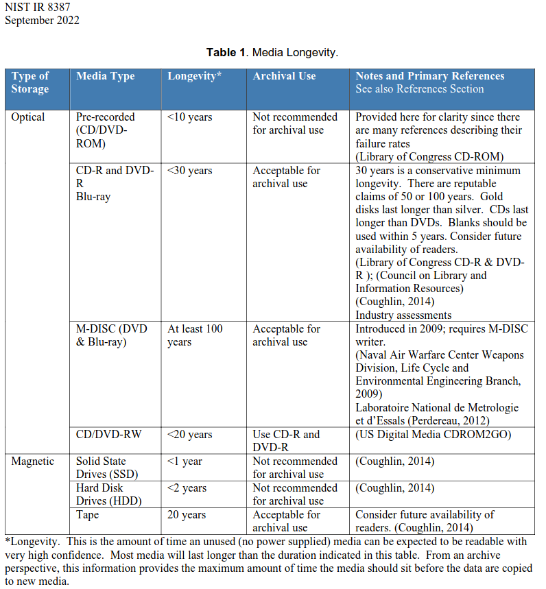
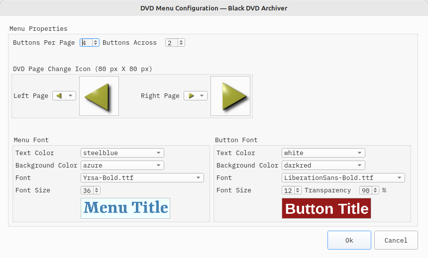
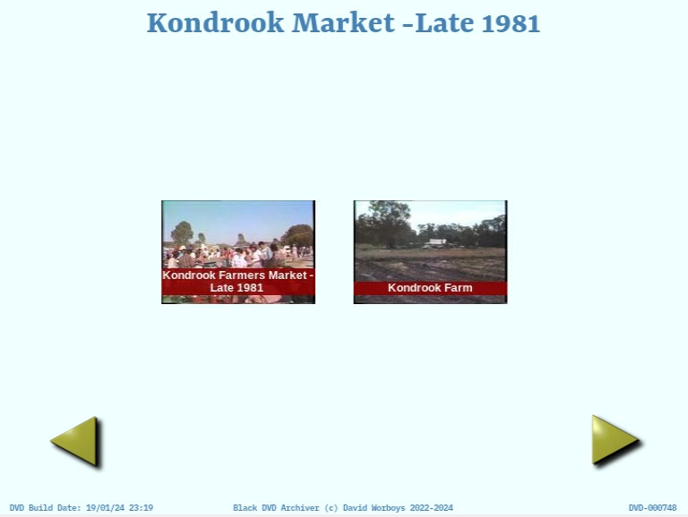
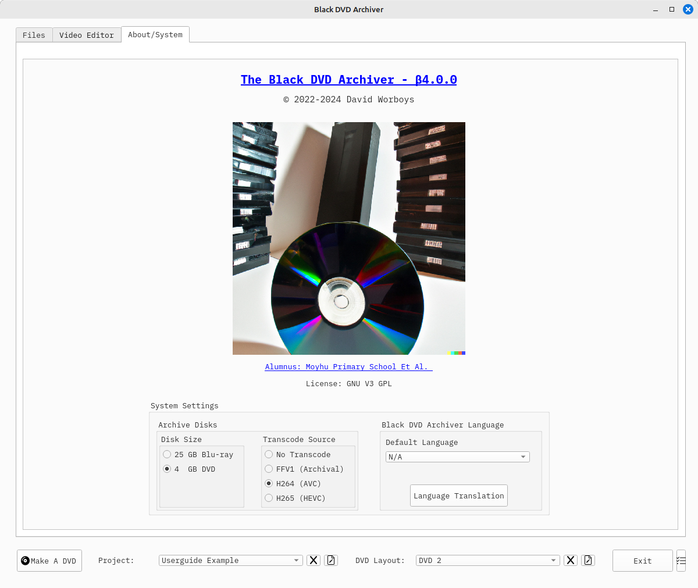
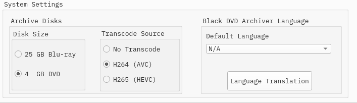
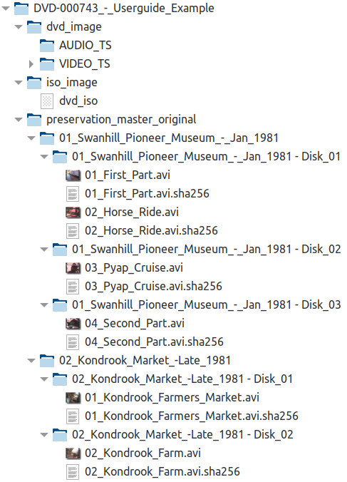
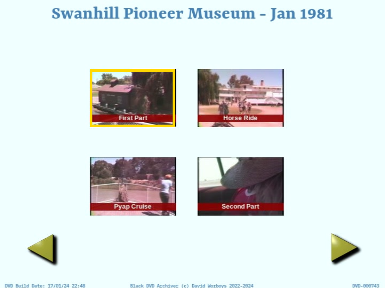
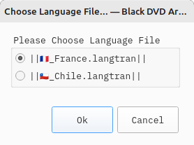

# The Black DVD Archiver — βeta 4.0 Release
### Author: David Worboys 
##### 2023-10-01 - Initial Draft
##### Update 2024-01-15
The Black DVD Archiver is an application that will place user selected video files on a DVD and the source files in an 
archive folder, specified by the user, that houses the preservation master folder.

Streaming files in H264 (AVC) format and wrapped in an mp4 container file are generated and housed in a streaming folder 
that can be used by a media player to view on a TV

The archive files are split into 25 GB or 4 GB folders, so that they can be burnt off to optical disc for backup. A 
sha256 checksum file is associated with each source video file in the preservation master folder to allow users to 
verify future data integrity of the video source files.  

## Why Black? 
Henry Ford is reputed to have said "...You can have any colour you like as long as it is black..." likewise, you can 
have any DVD/Video settings you want in The Black DVD Archiver as long as they are the settings the author chose.
 
These settings are optimised at getting VHS, Beta and 8mm analogue video onto a DVD at the best possible quality that 
allows 2 hours to fit on a 4.7 GB disk.

Hi-definition video will be down scaled to DVD resolution for the DVD image but the original resolution will be 
maintained in the preservation master and streaming folders.

The Black DVD Archiver is designed to do this task with the least amount of work by the user and to produce a DVD with 
a consistent menu layout suitable for a collection.

Can the author be persuaded to be more flexible and add additional features? Possibly...with a very good reason.

## Features
* Selection Of Input Files In A Variety Of Container Formats
* A Simple Video Editor with frame accurate editing on compressed video files with closed GOPs (Group of Pictures)
  * Only the GOP containing the edit cut is re-encoded, the rest of the file is copied so there is no visible quality 
  loss and the video edit is faster
* Limited Video Filters With Fixed Settings
* DVDs Have A Simplified Menu Structure
* Saves The Input/Output Files Into A User-Selected [Archive Folder Structure](#archive-folder-structure). 
  * This Can Be Placed On A NAS (Network Attached Storage) device for easy access.
  * An ISO image of the DVD is produced so that DVD burning software can produce the physical DVD. 
    * Brasero is a good choice, choose the "Burn Image" option (https://wiki.gnome.org/Apps/Brasero)
  * The archive files in the preservation master folder are split into 25 GB or 4 GB folders, so that they can be burnt 
  off to optical disk for backup. 
    * Check sums are calculated for source video files and are stored with them to verify the integrity of the source 
    video files at a later date
    * Transcoding source video into the FFV1 video format with FLAC audio stored in an MKV container file is supported  
    for the preservation master video files. 
      * This is, increasingly, the preferred archving format used by archiving institutions
      * These files are large but will not have compression artefacts
* Streaming files are automatically generated and can be stored on a [NAS](#streaming-folder-structure) for easy viewing on TV with a media player 
   
## Why Archive To DVD/Blu-ray?
In short, because DVD/Blu-ray disks are offline, they last, and they are easy to share.

SD cards, USB and Solid State Drives are not long-term storage solutions because data stored on them is held in tiny 
cells as an electric charge that slowly leaks away.  Refer to https://arxiv.org/pdf/1711.11427.pdf for detailed 
information on this type of memory storage.

Similarly, Hard Disk Drives are not reliable because they are electromechanical devices with components that degrade 
over time even sitting on a shelf.  In fact, do not bet on more than 10 years from either, and I have seen both go bad 
in a lot less than that.

Offline magnetic tape storage can be long-lasting, if stored correctly, but requires specialised cassettes and drives. 
The drives to read these cassettes maybe be especially hard to source for individuals in decades to come as they are 
niche products.

Storing data in the cloud is betting on a companies' longevity, security, backup policies and continued support. It also 
depends on people passing on their login details after they die and making arrangements to pay for the service indefinitely.

_Archiving important material should take an in depth planned approach that utilises some (or all) of the above methods to 
avoid long-term data loss, taking into account the deficiencies of each backup method._ 

**_Offline optical discs (DVD/Blu-ray) are the last best line of defence and the longest lasting and most accessible for
individuals, particularly if neglected._**

**Archiving for individuals** means a descendant can be digging through a hot dusty attic in say 50 years or a century 
and finding media that has retained data. 

Because DVDs are ubiquitous and held in official archives, it is highly likely a means can be found to play them or 
transfer their contents to future media for playback and sharing.

Successful consumer media playback and recording formats have very long lives, and because people collect them, there is 
an incentive to find a way to play them back. Records, Cassettes, VHS, CD, DVD and Blu-ray are all testaments to this.

Case in point VHS tapes, I have some now over 40 years old and I can still play them. 

**Quality** DVD-R's/Blu-ray's burned correctly are the only media that an individual can rely on for long-term archiving 
today. I have some DVD-R's on a shelf behind me that are over 20 years old and test just fine.  I have CD-R that are 
over 25 years old and they test fine.  

For the longest data storage Ritek M-Disc is the way to go: https://www.ritek.com/business-detail/index/1/id/1/title/M-DISC 

Verbatim archival grade DVD-R's are also a good choice: https://www.verbatim.com/prod/optical-media/dvd/archival-grade-gold-dvd-r/ultralife-archival-grade-gold-dvd-r/

The best approach would be burn copies to both and store in separate locations. 

**Never use Blu-ray LTH discs for archival storage as they will not last as long as the original HTL (MABL - Metal 
Ablative Layer) Blu-ray discs**
https://francearchives.fr/file/5f281a39048987dcef88202816a5c8ade880552e/static_6187.pdf (In French, 2012)

Source: https://ia801503.us.archive.org/7/items/nist-ir-8387/NIST.IR.8387.pdf

## Points To Note
* Hi-Definition video is maintained as such in archive and streaming folders
  * Hi-Defintion files have a vertical resolution greater than the respective PAL/NTSC DVD height
  * A lower resolution DVD compliant disk image is produced by the DVD building process 
* PAL Specs — 720 W * 576 H, Aspect Ratio 4:3, 25 frames a second interlaced (50 fields a second)
* NTSC Specs — 720 W * 480 H, Aspect Ratio 4:3, ~30 (29.97) frames a second interlaced (~60 fields a second)
* 16:9 Aspect ratio, usually from camcorders, uses the same resolution just remaps pixels from square to rectangular
* Interlaced videos are kept as interlaced. Resizing and deinterlacing are best left to the display device
* Only 4 GB Single Layer DVD and 25 GB Single Layer Blu-ray optical discs are supported as they are assumed to have the 
best archival qualities
* The Archive folders are split into 25 GB (Single Layer Blu-ray) or 4 GB (Single Layer DVD) folders as chosen by the 
user
  * Each video file has an associated sha256 checksum file to allow users to verify the integrity of the video file 
  contents
  * Allowed archive video formats are: 
    * The original video format, FFV1, H264 (AVC) and H265 (HEVC)
  * The FFV1 archive option produces FFV1/MKV preservation masters as used by the Library of Congress and other 
  leading video preservation organisations 
    * https://blogs.loc.gov/thesignal/2023/12/embracing-ffv1-matroska-container-preferred/ 
* Supported Container Formats 
  * mp4, avi, mkv, vob,mod,mov,webm,m4v,3gp, 
    3g2, mj2,mkv,mpg,mpeg,ts, m2ts, mts,qt,
    wmv, asf,flv,f4v,ogg,ogv,rm, rmvb,divx,mxf,
     dv,mts

# User Manual
## System Requirements
The Black DVD Archiver is a Linux program licensed under the terms of the GNU General Public License v3.0.
* A Linux operating system — Debian based
* Developed and tested on Linux Mint and tested on a minimal MX Linux install
* 16+ GB RAM
* 50+ GB of free disk space 
*  1+ TB Video file work drive as video requires a great deal of disk space to store and process
* A DVD/Blu-ray burner drive to write the optical disc images

## Installation

* Download the "black-dvd-archiver" (https://github.com/David-Worboys/Black-DVD-Archiver/releases/tag/%CE%B23.0.0) to 
your Programs folder.

* Right-click on the "black-dvd-archiver" file and select "Properties." This will open the window below, select 
"Permissions" and tick "Allow executing file as program" and then "Close" 
 
* Double-click on the "black-dvd-archiver." It will take a few seconds to start.

## The Main Window

When the "black-dvd-archiver" has started, the user will see the main window above.

### The DVD Properties Panel

The DVD Properties panel displays:
 * _Video Standard_ - PAL/NTSC. This is set by the videos displayed in the "DVD Input Files" 
panel
   * A DVD is permitted to only be PAL or NTSC
   * Hi-Definition video files (e,g 720p, 1080i, 1080p) are allocated a PAL or NTSC designation based on their properties 
   although they do not conform to the established defitions of PAL/NTSC
 * _Duration_ - This is set by the videos selected in the "DVD Input Files" panel.
   * Maximum 2 hours
 * _Avg Bitrate_ - The bit rate used to encode the DVD. 
   * Fixed and set to 5.5 Mb/s. This allows 2 hours of video on a DVD in high quality
 * _DVD_Used_ - The percent of the DVD used by the selected files.
   * Only 99% is available this allows 1% to cover for any time overruns.
     * The added benefit of providing a small buffer on the outer edge of the DVD is to protect the DVD from edge damage 
 * #### _Archive Folder_ 
   * This is set by the user — refer to  [Archive Folder Structure](#archive-folder-structure) for a detailed discussion
   * The Archive Folder is where the DVD image, ISO image (used to burn a DVD) and 
   video source files are stored
   * The Archive Folder is best placed on a NAS (Network Attached Storage) device which is properly backed-up
   * The DVD file folder is comprised of a unique code and descriptiion: e.g., **_DVD-000743_-_Userguide_Example_** 
     * **000743** - Automatically allocated sequential folder number
     * **Userguide_Example** - Either the _Project Name_ or the _Disk Title Name_ . Refer to 
     [DVD Layout](#dvd-layout-window) for details
 * #### _Streaming Folder_
   * Set by the user (optional) — refer to  [Streaming Folder Structure](#streaming-folder-structure) for a detailed 
   discussion
     * Defaults to a sub-folder of the Archive Folder if not set 
   * The Streaming Folder is where H264 (AVC) compressed video files stored in .mp4 container files reside
     * These files are automatically produced as part of the DVD build process 
   * The Streaming Folder is best placed on a NAS (Network Attached Storage) device which can be accessed by a media 
   player like Serviio https://www.serviio.org
    
 * #### _DVD Build Folder_ 
   * This is set by the user
   * The folder in which all the assets required to build a DVD are marshalled into uniquely named sub-folders
     * These folders will be deleted on successfully completing a DVD build.
   * The relevant files will be copied from here to the [Archive folder](#archive-folder) when a DVD build is complete
 
### DVD Input Files Panel

Displays the list of video files selected to comprise a DVD project
* _Select All_ - Checking this selects all video files in the grid. Unchecking deselects all files in te grid
*  — Enables and selects the [Video Editor Tab](#video-editor-tab)
* _Grp_ - Displays the group a video file belongs to (optional)
* _Video File_ - Displays the video file name or video title 
* _Width_ - Displays the video file width
* _Height_ - Displays the video file height
* _Encoder_ - Displays the video encoder used to encode the video file
* _System_ - Displays the video file TV system (PAL/NTSC)
* _Duration_ - Displays the video file duration in hours, minutes, seconds

At the bottom of the video file grid is the _Default Video Filters_ and control buttons.

#### Video File Filters
* _Default Video Filters_ - These are the video filters applied by default to the project files.
    In general, it is best not to filter unless absolutely required as it takes time and can impact image quality. The 
    settings chosen for these filters are aimed at having the minimal impact on video quality

  * _Normalise_ - Attempts to bring out the shadow details
  * _Denoise_ - Applies a light noise filter to the video files (Can be slow)
  * _White Balance_ - Attempts to correct the white balance of the video files
  * _Sharpen_ - Applies a light sharpen to the luminance channel only
  * _Auto Levels_ - Attempts to brighten a video. If you need this then the video is likely to be of poor quality and 
  good results cannot be expected.

#### File Command Buttons
The operation of these buttons is as follows:
  *  — Opens [The Choose Video Files Window](#the-choose-video-files-window)
  *  — Delete the checked (selected) video files from the file grid
  *  — Moves the checked (selected) video files down in the grid
  *  — Moves the checked (selected) video files up in the grid
  *  — Toggles the _Video File_ name displayed in the grid between the video 
  file name and the DVD menu name
  *  — [Joins/Transcodes the checked (selected) video files](#jointranscode-files) 
  *  — Removes the grouping from the checked (selected) video files
  *  — Groups the checked (selected) video files together
    * Grouped files stay on the same DVD page
  *  — Opens the [DVD Menu Configuration Window](#dvd-menu-configuration-window) 

At the bottom of the _Main Window_ are the following buttons:
*  - Opens the "Task Manager" popup window.
  * The "Black DVD Archiver" runs the "Make DVD" process as a background task.
    * This allows the user to submit multiple "Make DVD" requests whilst waiting for the "Make DVD" processes to 
    complete
    
  * 
  
    *  Select "Select All" or check (select) the task that needs to be killed.
    * Click "Kill Task" to kill the selected tasks.
    * Clik "Ok" to close the "Task Manager" popup.
      * If this is done without killing tasks, then the tasks are left running and the window closes
   

*  — Exit the "Black DVD Archiver"
    * Save's the current view which is then loaded when the "Black DVD Archiver" is started again
    * Prompts to kill running background tasks if the user wishes to exit immediately
*  — Manages project DVD layouts. 
  * The DVD layout combo box allows users to select the desired DVD layout by clicking on it.
  * If a project has more than 2 hours of video, then more than one DVD layout will be needed
  * DVD layouts also allow for different DVDs to be produced from the project video files
    *  — Delete a DVD Layout
    *  — Opens the _Enter DVD Layout_ window to create a new DVD layout
      * 
      
*  - Manages projects. 
  * A project comprises video files displayed in the file grid and the dvd layouts associated with it
  * The project combo allows the user to select the desired project by clicking on it,
  * Projects are saved when changed or the user exits the "Black DVD Archiver" or changes projects
    *  — Delete a Project and all associated DVD layouts
    *  — Opens the _Enter Project Name_ window to create a new project
      *  
      
*  — Opens the [DVD Layout Window](#dvd-layout-window) which allows the user 
to create a DVD

## The Choose Video Files Window

This window allows the user to choose the video files for the DVD project. 
* Click on the video files required and click on the _Ok_ button when done.
* _Select All_ - Checking this selects all video files in the grid. Unchecking deselects all files in the grid

 — Use this button to select the video file source folder
* Opens the window below which allows the user to navigate the folder tree to the desired folder.
  * 

## Join/Transcode File(s)
Clicking the Join File(s) Command button  on the [Main Window](#the-main-window) 
will open one of two dialog boxes depending on the number of files selected

**One File Selected**

When only one file is selected (checked) then that file can be transcoded to a different video file type.
  * _Make Edit File_ - produces a very high quality intermediate (mezzanine) video file suitable for frame accurate 
editing
    * Use this option if frame accurate editing fails on the source video file.
      * Hi-Defintion video files have proved problematic for  frame accurate editing and this is the recommended editing
      option for them.
    * The format used is MJPEG and utilises an avi container file.
    * Although it is labeled as _Slow_ it is actually reasonably fast as far as transcodes go although it does produce 
    large video files
  * _Re-Encode H264_ -  produces an H264 (mp4) vidoe file that has closed GOP's which should allow for frame accurate 
  editng, alhough this is not recommended. Use the _Make Edit File_ option if the file needs to be edited 
       * Use this option for creating video files sutiable for streaming in media players
       * Selecting this option will markedly slow down the transcode time but will produce smaller video files
  *  _Re-Encode H265_ produces an H265 encoded video file in an mp4 container that has closed GOP's which should allow 
for frame accurate editng, alhough this is not recommended. Use the _Make Edit File_ option if the file needs to be 
edited
      * This is a newer file format than H264 and is gaining popularity although it is not as widely supported.
      * The video file produced is smaller in size than an H264 encoded video file and will likely show less compression 
     aretefacts in a smaller video file
      * Selecting this option will result in transcodes that take a considerable time to produce

**Two Or More Files Selected**

When two or more files are selected (checked) the files will be joined together. The first of the selected files 
becomes the joined video file and the other selected video files are removed from the grid.

With the exception of _Stream Copy_ , the optoins presented to join files are the same as for re-encoding a single file,
as detailed in greated detail in the abovie **One File Selected** section. 

  * _Stream Copy_ - This option only appears if the selected files are the same type of video file in the same container
file format. 
    * This is a very fast operation and there is no quality loss in performing the join.
  * _Make Edit File_ - Joins the video files into a very high quality intermediate (mezzanine) video file suitable for 
frame accurate editing. 
  * _Re-Encode H264_ - Joins the video files into a H264 (mp4) vidoe file that has closed GOP's which should allow for 
frame accurate editng, alhough this is not recommended. Use the _Make Edit File_ option if the file needs to be edited
  * _Re-Encode H265_ - Joins the video files into a H265 encoded video file in an mp4 container that has closed GOP's 
which should allow for frame accurate editng, alhough this is not recommended. Use the _Make Edit File_ option if the 
file needs to be edited

## DVD Menu Configuration Window

This window allows the DVD menu properties of the "Black DVD Archiver" to be set.

DVD menu pages consist of a grid of image buttons with text placed on the bottom of each button image.

When video files are grouped or there are fewer button titles on the menu page than the grid allows for, then the
buttons are laid out in the most pleasing possible manner by an internal algorithm 

### Menu Properties Panel

* _Buttons Per Page_ - Set the maximum number of DVD menu buttons on a menu page.
  * The Minimum is 1 and the Maximum is 6
* _Buttons Across_ - Set the maximum number of DVD buttons across the menu page
  * The Minimum is 1 and the Maximum is 4

### DVD Page Change Icon (80px X 80 px)

The DVD page change icons are placed on the DVD menu when more than one DVD menu is generated.

The actual icon display size is a square 80 pixels by 80 pixels, and these are displayed at actual size beside each
icon selection combo box

The current icon set is not as pleasing as I would like and will be expanded/revamped in a future release. Feel free to 
send me additional icons that are 80 pixels square.

* _Left Page_ - This combo box allows the user to select the left page change icon for the DVD menu
* _Right Page_ - This combo box allows the user to select the right page change icon for the DVD menu

### Menu Font Panel

* _Text Color_ - This combo box sets the colour of the title text at the top of each DVD menu page
  * This is the same for all DVD menu pages
* _Background Color_ - This combo box sets the background colour of the DVD menu page
  * This is the same for all DVD menu pages
* _Font_ - This combo box sets the font of the title text at the top of each DVD menu page
  * This is the same for all DVD menu pages
* _Font Size_ - This combo box sets the font size of the title text at the top of each DVD menu page
  * This is the same for all DVD menu pages
### Button Font Panel
* _Text Color_ - This combo box sets the colour of the title text on the image button 
  * This is the same for all DVD image buttons
* _Background Color_ - This combo box sets the background colour of the title text on the image button
  * This is the same for all DVD image buttons
* _Font_ - This combo box sets the font of the title text on the image button
  * This is the same for all DVD image buttons
* _Font Size_ - This combo box sets the font size of the title text on the image buttons
  * This is the same for all DVD image buttons
* _Transparency_ - This combo box sets the transparency of the title text and text background on the image buttons
  * This is the same for all DVD image buttons
  * Given that the text and background colour are overlaid on the bottom part of the image button, making this a little 
  transparent might be more visually pleasing

## Video Editor Tab

This tab enables basic video editing functionality. It is accessed via the button on the
[DVD Input Files Panel](#dvd-input-files-panel)  

### DVD Settings Panel

* _Menu Title_ - the user enters a menu title here.
  * By default, a menu title is automatically extracted from the file name. The user can override this.
* _Video Filters_ - The video filters to be applied to the file. [Video File filters](#video-file-filters) describes 
these settings in greater detail. 

### Video Cutter Panel

The video cutter panel is where a video is displayed, edit points are set and where a DVD image button image is 
selected. 

**If the video is interlaced, the image might appear to have jagged lines through it. This is normal and will 
not show on DVD play back**

The scroll bar is used to quickly move through the video. The scrollbar handle is clicked and dragged left or right 
to move through the video.

The following controls are available:
*  — The **[** sets the start of an edit point and **]** sets the end of an 
edit point. 
  * These buttons toggle to ensure that start and end points are selected properly
      * When **[** is pressed, it is disabled and **]** is enabled
      * When **]** is pressed, it is disabled and **[** is enabled
  * When the **]** is pressed, the cut points are added to the [Edit List Panel](#edit-list-panel)
*  — Steps back according to the _Step_ setting.
*  — Steps forward according to the _Step_ setting.
*  — Commence playing the video
*  — Pauses playback
*  — Combo that sets the step interval. The following options are available:
  * _Frame_ - Step forward/backward a single video frame
  * _0.5 Sec_ — Step forward/backward 0.5 seconds
  * _1.0 Sec_ — Step forward/backward 1 second
  *  _15 Sec_ — Step forward/backward 15 seconds
  *  _30 Sec_ — Step forward/backward 30 seconds
  *   _1 Min_ — Step forward/backward 1 minute
  *   _5 Min_ — Step forward/backward 5 minutes
*  — Displays the current video frame
*  — Set the video frame used for the DVD image button
    * Clicking the camera icon sets the video frame
    * Clicking on the frame jumps the video to that point
    * Clicking on the **X** removes the set video frame
    * **Set this after all editing on the clip is complete as this setting is an absolute offset into the video clip and
  is not adjusted when the clip is edited**
*  — Displays the selected source file. This is not user-editable

### Edit List Panel

The edit list panel displays the list of edit points for the selected video clip. The user may also enter a clip name 

* _Select All_ - Checking this selects all the edit points in the grid. Unchecking deselects all the edit points in te 
grid
* _'To Cut' Bar Graph_ -  On the top right a bar graph indicates the percentage of files 'To Cut' during the 
file cutting process. The cutting process starts at 100% and counts down to 0%
  * The cutting process can be slow on lower end machines, as frame accurate cutting of compressed video files, like
  H265, H264 and MPEG2, requires additional file analysis. 
  * Compressed video files must have closed GOPS (Group of Pictures) for a frame accurate cut.
* _Clip Name_ - Double-clicking in this field allows the user to enter a clip name
  * This is of most use if the video is to be cut into multiple clips
  * If the edit point is to be cut out, then there is no need to enter a clip name
*  — Delete the checked (selected) edit points from the grid
*  — Moves the checked (selected) edit points down in the grid
*  — Moves the checked (selected) edit points up in the grid
*  — Cut the edit points from the video file
*  — Opens a pop-up window to allow the user to choose how the selected edit 
points are assembled.

  The file cuts will take time, particularly if the video source files are large and the computer is a lower end machine, 
  due to the preliminary file analysis and large amounts of data involved. The user will just have to wait for the 
  process to complete.

  * 
    * The following two methods are available to assemble the edit 
    points.
      * _As A Single File_ - The edit points are joined into a single file
      * _As Individual Files_ - Each edit point becomes a file named according to the clip name or, if not provided, a 
      default name. This will open the file namer popup when the edit points are cut out.
      *  
        * If the user needs to change a file name, double-click on the file name and enter the new file name
        * If the file name is invalid, an error message will be displayed

## DVD Layout Window

The DVD layout window allows the user to modify the DVD layout before proceeding to generate the DVD.

This window opens in response to clicking on in the 
[Main Window](#the-main-window). Further information is found under [Command Buttons](#file-command-buttons)

The layout displayed in this example reflects the use of grouping displayed in the main window and visible in the 
background
* _Disk Title_ - Defaults to the project name combined with the DVD Layout name
  * In this release this is used as the trailing part of the archive folder name (xxx) - DVD-nnn_-_xxx . Refer to  
  [Archive Folder Structure](#archive-folder-structure) for a detailed discussion. 
* Each row in the grid is a DVD menu page
  * By double-clicking in the _Menu Title_ field a title can be entered for a DVD menu page
* The videos on each DVD page are displayed in the _Videos On Menu_ column
* _Menu Aspect Ratio_ - Select 16:9 for wide screen menus and 4:3 for the traditional squarish menus.
    *  Each DVD menu page is either all 4:3 videos or all 16:9 videos as per the DVD spec. THe 'Black DVD Archiver' 
  automatically enforces this, and it is not possible to produce a mixed aspect ratio menu page.
    * If a 16:9 wide screen menu is chosen and there are 4:3 videos on the DVD then the 4:3 image buttons will be 
  stretched to 16:9 and will look 'wrong'.
* _Deactivate Filters_ - Select this to test the layout generation of the DVD. Filters are slow and this makes the DVD 
generation process as fast as possible
*  — Moves the checked (selected) DVD menu page(s) up
*  — Moves the checked (selected) DVD menu page(s) down
*  — Delete the checked (selected) DVD menu page(s)
*  — Save the DVD layout under the selected layout name (_DVD 2_ in this example)
*  — Starts the DVD generation and archive process

#### Button Title Grid

Button Title grids detail the video clips button title on each DVD page. A user can double-click on the _Button Title_ 
field and change the button title for the video clip

*  — Move the checked (selected) button title(s) up
*  — Move the checked (selected) button title(s) down
*  — Delete the checked (selected) button title(s)

## About/System Tab

This tab:
  * Displays the Black DVD Archiver version with clickable links to access the associated Github repository
  * Provides access to the "System Settings" panel.

### System Settings
"System Settings" contains the "Archive Disks" and the "Black DVD Archiver Language" control panels

### Archive Disks
#### Disk Size  

The "Disk Size" panel allows the user to select the archive video optical disc size. This allows the user to 
burn off the **_preservation_master_xxx_** folder **nn_xxx_Disk_nn_** sub-folders onto backup optical discs for offline 
long-term archival storage of the source video files.

Note: The **_preservation_master_xxx_** folder name can take the following forms depending on the [Transcode Source](#transcode-source) 
setting:
  * _preservation_master_original_
  * _preservation_master_ffv1_
  * _preservation_master_h264_
  * _preservation_master_h265_

**Only 25 GB for Blu-ray discs and 4 GB for DVD discs is permitted. This is because these are single layer optical 
discs and these are assumed to have better long-term archival longevity.**

The source video of the DVD is backed-up into the [Archive Folder](#archive_folder) and is stored in the 
[Transcode Source](#transcode-source) video format.
These source files may be much larger than the DVD compressed video. 
  * In the examples here DV compression of the captured video stored in an avi file container consume 13GB per hour!

##### Archive Folder Structure
Under the [Archive Folder](#archive-folder) selected by the user, each DVD build results in a new archive folder being 
created and named automatically by the "Black DVD Archiver"

* Under [DVD Properties](#the-dvd-properties-panel), the user selects the [Archive Folder](#archive-folder) location as 
a permanent place to store the archived files associated with producing a DVD image. 

  * Ideally the [Archive Folder](#archive-folder) would be on a backed-up NAS (Network Attached Storage) but could be 
  any old drive, internal or external, particularly if the plan is to use the folder as a temporary source for burning 
  off the DVD and video source archive files to optical disc 
    

Let's consider this example

  

* Folder **_DVD-000743_-_Userguide_Example_** was created under the **preservation_master_origial** folder at the 
successful conclusion of the [Make DVD Process](#dvd-layout-window) initiated by the user when the "Make A DVD" button 
was clicked.
  * Folder _**preservation_master_original**_ contains the source video files in the original video format to maintain 
  original quality.
    * The trailing **_original** indicates that the source video files are not transcoded but kept in their original  
    video format. 
  
    These are all the allowed preservation master folder names  
      * _preservation_master_original_
      * _preservation_master_ffv1_
      * _preservation_master_h264_
      * _preservation_master_h265_
  
      Refer to [Transcode Source](#transcode-source) for more information

  * The folder structure mirrors the DVD menu structure
    * 
    * 
  * **DVD menu 1** (Swanhill Pioneer Museum - Jan 1981)  becomes **_preservation_master_original_** folder 
**_01_Swanhill_Pioneer_Museum_-_Jan_1981_** and
  * **DVD menu 2** (Kondrook Market - Late 1981)  becomes **_video_source_** folder **_02_Kondrook_Market_-Late_1981_**
  * This allows for folder navigation that mirrors the DVD menu video structure
  * Under the folder **_01_Swanhill_Pioneer_Museum_-_Jan_1981_** the source video folders are broken up into sub folders 
that mirror the image buttons on the DVD menu 
     * **_01_Swanhill_Pioneer_Museum_-_Jan_1981 - Disk_01_** 
     * **_01_Swanhill_Pioneer_Museum_-_Jan_1981 - Disk_02_**  
     * **_01_Swanhill_Pioneer_Museum_-_Jan_1981 - Disk_03_** 
  
  * In each of these folders, the source video files are stored — in this case with a file suffix of **_.avi_** 
    
      * If a source video file does not fit on to an archive optical disc, then it is split into parts and additional 
    **_nn_xxx-Disk_nn_** folders are created as needed. 
        * **_Note: in the current implementation, these folders are not optimally packed_**
    
  * Along with the source video file, a check sum file (file suffix **_.sha256_**) is also created.
    
      * This check sum file can be used to check the associated source video file for data corruption at a later date.
    
    * For example, **_03_Pyap_Cruise.avi_** & **_03_Pyap_Cruise.avi.sha256_** form a _check_ pair
    * To check a video file at a later date, a sha256 check sum of the file is computed and compared with the check sum 
    stored in the paired **_.sha256_** file.
      * If they match, the avi file has not experienced data corruption.
      * This link contains instructions on how to do this on linux: https://lindevs.com/generate-and-verify-sha-256-hash-of-file-in-linux/
* Folder **_iso_image_** contains a DVD disk image (**_dvd_iso_**) that can be burnt to a DVD optical disc.
  * Brasero is a good choice, choose the "Burn Image" option (https://wiki.gnome.org/Apps/Brasero)
* Folder **_dvd_image_** stores the DVD files in a folder structure that mirrors the DVD. This allows media players to 
play the DVD which an iso file does not permit.  

##### Streaming Folder Structure
 The [Streaming Folder](#streaming-folder) is where the automatically generated H264 (AVC) video files in an mp4 
 container file are stored.
* If the [Streaming Folder](#streaming-folder) is not set then the [Streaming Folder](#streaming-folder) becomes a 
sub-folder of the [Archive Folder](#archive-folder) as illustrated below:
  *  

* If the [Streaming Folder](#streaming-folder) is set by the user, for example in a folder named "streaming_files", then 
the streaming folder structure will take the form below:
  * 
* In either case the file naming convention mirrors that of the DVD menus and menu image buttons detailed in
[Archive Folder Structure](#archive-folder-structure), except there is no splitting by optical disc
  * Folder **DVD-000748_-_Userguide_Example** is the parent folder 
    * Folder **01_Swanhill_Pioneer_Museum_-_Jan_1981** is the first DVD Menu **Swanhill Pioneer Museum - Jan_1981**
      * The file **01_First_Part.mp4** is image button **First Part** on the first DVD Menu 
      **Swanhill Pioneer Museum - Jan_1981**
      * The file **02_Horse_Ride.mp4** is image button **Horse Ride** on the first DVD Menu 
      **Swanhill Pioneer Museum - Jan_1981**
      * The file **03_Pyap_Cruise.mp4** is image button **Pyap Cruise** on the first DVD Menu 
      **Swanhill Pioneer Museum - Jan_1981**
      * The file **04_Second_Part.mp4** is image button **Second Part** on the first DVD Menu 
      **Swanhill Pioneer Museum - Jan_1981** 
    * Folder **02_Kondrook_Market_-Late_1981** is the second DVD Menu **Kondrook_Market - Late_1981**
      * The file **01_Kondrook_Farmers_Market.mp4** is image button **Kondrook Farmers Market** on the second DVD Menu
       **Kondrook_Market - Late_1981**
      * The file **02_Kondrook Farm.mp4** is image button **Kondrook Farm** on the second DVD Menu  
      **Kondrook_Market - Late_1981**
    
* Ideally the [Streaming Folder](#streaming-folder) would be located on a backed-up NAS (Network Attached Storage) device but it 
could just as easily be placed on any old drive, internal or external that is easily accessed by a media player
(I am a fan of Serviio https://www.serviio.org ) for playback of the video on a TV.
#### Transcode Source

The "Transcode Source" panel allows the user to archive the source video as follows:

* _No Transcode_ — This is the preferred option as the source video is archived in the original, untouched, video format. 
  * The fastest option as the source video is copied into the appropriate archive folders and will not slow 
  down the [Make DVD Process](#dvd-layout-window).
  * **There is a risk in archiving video files in the orginal format** 
    * if that format is proprietry or not widely supported then the source video may prove hard to view/edit at a later 
    date 
* _FFV1 (Archival)_ — This is a preferred method of archiving video files by the Library of Congress and other 
leading video preservation organisations. 
  * FFV1 uses entirely open source software to produce archival video files that are free of compression aretefacts due 
  to the lossless compresion process used.  
  * Takes much longer to transcode the source video than selecting the _No Transcode_ option. 
  * The resulting archival video files are very large.
    * Highly recommended to use [25 GB Blu-ray disks](#disk-size) with this option
  * Rapidly increasing in popularity amongst video preservation organisations
  * Refer to  https://en.wikipedia.org/wiki/FFV1 for more 
  information.    
* _H264 (AVC)_ — This is the same format Blu-ray uses and is very widely supported,
  * A lossy compressed video format that trades-off video quality (not necessarily visible) and may show compression 
artefacts in return for  smaller file sizes
  *  Takes longer to transcode the source video than selecting the _No Transcode_ option.
  * **_It is not recommended to use this option unless disk space is at a premium._** 
* _H265 (HEVC)_ — This newer video format supports higher compression and, thus, smaller file sizes than H264 at the 
same quality.
  * A lossey compressed video format that trades-off video quality (not necessarily visible) and may show compression 
artefacts in return for much smaller file sizes
  *  Takes much longer to transcode the source video than H264
  * **_It is not recommended to use this option unless disk space is at a premium._**

Choosing to transcode the source video into FFV1, H264 or H265 will result in an extended [Make DVD Process](#dvd-layout-window) and 
the user will have to leave the "Black DVD Arciver" open to allow this process to complete. 
 * To check if the [Make DVD Process](#dvd-layout-window) is complete, the user opens the [Task Manager](#file-command-buttons) popup 
window
 * The H264/H256 transcode process closes all GOPs (Group of Pictures) to make then suitable for editing. GOP size is
currently 15 which matches the DVD spec but will result in larger compressed files.
   * Video source files that are already in H264/H265 format will not be transcoded and will retain their current GOP 
settings
     * These files will be copied and the [Make DVD Process](#dvd-layout-window) will be much faster as a result
 * FFV1 video source fies will be copied and the [Make DVD Process](#dvd-layout-window) will be much faster as a result

#### Black DVD Archiver Language

The "Black DVD Archiver Language" panel allows a user to select the default language the "Black DVD Archiver" displays by
selecting the country in the "Default Language" combo box.
* **Note: A country only displays in the "Default Language" combo box if it has been set-up or imported in the "Language 
Translation" popup window.**
* Once a language is selected, then the user must exit the "Black DVD Archiver" and restart for the language selection to
take effect
* At this time no language translations have been provided

##### Language Translation Popup Window
The "Language Translation Popup Window" is accessed by clicking on the  
button.

This opens the "Language Translation Popup Window" where users can select the country of the language and enter 
translated phrases.

  **Note: A translated phrase currently must be the same length or of a shorter length than the corresponding English 
phrase to avoid control layout issues in the "Black DVD Archiver"**

##### Language Translation Command Buttons
The operation of the command buttons is as follows:

 — This combo box allows the user to select the country they are 
performing the translation for. 
  * This must be the first action the user takes if not importing a language translation

 — This grid button copies the corresponding English (Base) phrase to the 
clipboard. 
* This can be used to paste into Google translate or a similar website.
* Double-clicking in the corresponding "Language Phase" column allows the user to type or paste the translated phrase.

 — This button saves the entered translation phrases into the database

 — This button exports the translated language to the users Document 
folder in a subfolder named **langtran**
 * 
 * **Note: The three files created when exporting a country language. All three must be copied when sending to someone else**

—This button imports a country language from the  **langtran** folder.
* When clicked, it will open the pop-up below to allow the user to select a country language to import.
  * 
    * Pressing "Ok" imports the country language
    * Pressing "Cancel" will stop the import process

  — This button closes the "Language Translation Popup Window"
* If any translation changes have been made, it will prompt the user to save the translations before closing the window.

##### Note
* The English (Base) phrases the "Black DVD Archiver" displays for translation are automatically extracted when a window 
 is opened. 

  * If a window has not been opened, then those English phrases will be missing. 
    * This particularly applies to error and warning messages.
    * When such a window is opened for the first time, it will place those English (Base Phrase) in the langtran 
    database and the user will need to translate them as they arise.
    
  * An effort will be made to fully populate the English (Base) phrases by V 1.0
*  Because of the way the "Black DVD Archiver" lays out the GUI (Graphical User Interface), translated phrases that are 
too long will mess up the layout of the user interface graphical elements.
      * To help prevent this, the user will be warned when a translated prharse is too long
        * First, a red warning message will be displayed at the top of the screen
        * Second, the offending translated phrase will display a "check" mark when "Saved"
          

 

